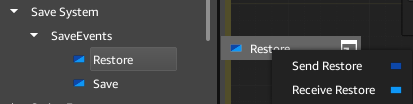
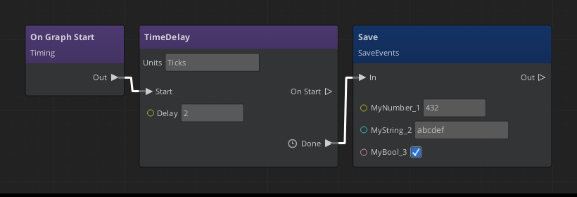
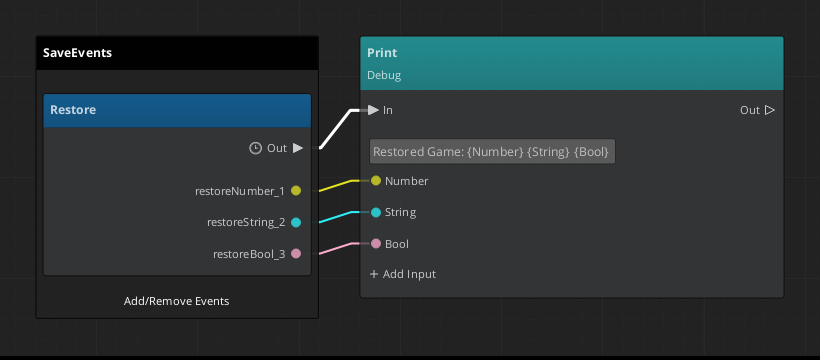

# Creating a Save System with Script Canvas, Script Events, and Lua

This tutorial covers an approach to save data from Script Canvas to disk. Currently there is no built-in way to accomplish this, but it can be done using a combination of features in Lumberyard.

At its core we will use a Script Event as a way of having bilateral communcation between Script Canvas and Lua.

### Why Lua?

Lua has libraries available to perform file operations, we will use these and an open source JSON library for Lua in order to save and restore our data.


##  Script Event

Create a new Script Event asset, name it: SaveEvents

- Rename Category to: Save System
- Add two events

### First Event

- **Name:** Save
- Add 3 parameters (you can add as many as you need, but for this tutorial we'll do 3).

- **Parameter 0:**
    - Name: myNumber_1
    - Type: Number

- **Parameter 1:**
    - Name: myString_2
    - Type: String

- **Paramter 2:**
    - Name: myBool_3
    - Type: Boolean

### Second Event

- **Name:** Restore
- Add 3 parameters that match the ones from Save **(IMPORTANT: they need to be named differently than the ones in Save)**

- **Parameter 0:**
    - Name: inNumber_1
    - Type: Number

- **Parameter 1:**
    - Name: inString_2
    - Type: String

- **Paramter 2:**
    - Name: inBool_3
    - Type: Boolean

## Notes:

For this tutorial, we are making these two events pretty identical, the reason is to avoid using the same event to both Send and Receive as this can create an infinite loop situation.

# Sending Script Event from Script Canvas

This example script simply waits a few seconds before sending some data using a Script Canvas event.

The Script Canvas event "SaveEvents" can be found on the Node Palette under the "Save System" folder (recall this is the category name we gave the Script Event we created in the first section of this tutorial).



# Lua

## json.lua 

We will use the open source https://github.com/rxi/json.lua as the JSON encoder/decoder. Download the file json.lua file and place it in **<your_project>\Scripts** 

We will use this package within Lua using the require keyword:

```lua
json = require "Scripts.json"
```

## SaveSystem.lua

For this tutorial we only need one Lua script, the first part of this script is to bind it to the Script Event asset.

```lua
local SaveSystem =
{
    Properties =
    {
        SaveSystemScriptEvents = { default=ScriptEventsAssetRef() },
    },
}
```

This section of the code will add an asset entry to the Entity's component that uses this Lua script. You will need to specify the Script Event asset we created in the first section.

Lua is able to connect to the new Script Event that was just created, it can handle events in a Script Event and it can broadcast events from the script.

The first step will be to get the Script Event and connect to it in order to handle its events

```lua
function SaveSystem:OnActivate()

    -- Connect to the Script Event (SaveEvents is the name of the ScriptEvent we specified in the ScriptEvent asset)
    self.theScriptEvent = SaveEvents.Connect(self)   
end
```

Having connected to the Script Event, the next step is to handle an event, we will only be handling the Save event in this Lua script, the Restore event will be handle in Script Canvas later.

```lua
function SaveSystem:Save(myNumber1, myString2, myBool3)

    -- The code that saves the data received will be saved to file here

end
```

Now, we need to look into how json.lua works, it's fairly straightforward, we will encode an object with all the value parameters provided, then we will use Lua's io library to save it to file.

```lua
function SaveSystem:Save(myNumber1, myString2, myBool3)

    encodedJsonData = json.encode({ myNumber1, myString2, myBool3})
    
    Debug.Log("JSON: " .. tostring(test)) -- prints: JSON: [432,"abcdef",true]
    
    -- Open a file for writing
    file = io.open ("mygamesavedata.json" , "w")

    -- Write the encoded JSON data
    file:write(tostring(encodedJsonData))

    -- Close the file
    file:close()

end
```

Complete Save Lua script:

```lua

json = require "Scripts.json"

local SaveSystem =
{
    Properties =
    {
        SaveSystemScriptEvents = { default=ScriptEventsAssetRef() },
    },
}

function SaveSystem:OnActivate()

    -- Connect to the Script Event (SaveEvents is the name of the ScriptEvent we specified in the ScriptEvent asset)
    self.theScriptEvent = SaveEvents.Connect(self)   
end

function SaveSystem:Save(myNumber1, myString2, myBool3)

    encodedJsonData = json.encode({ myNumber1, myString2, myBool3})
    
    Debug.Log("JSON: " .. tostring(test)) -- prints: JSON: [432,"abcdef",true]
    
    -- Open a file for writing
    file = io.open ("mygamesavedata.json" , "w")

    -- Write the encoded JSON data
    file:write(tostring(encodedJsonData))

    -- Close the file
    file:close()

end

function SaveSystem:OnDeactivate()
end

return SaveSystem

```

We will place the Restore system in its own Lua script, this will enable us to have a different entity that once activated, it will load the saved data and broadcast it out.

```lua
json = require "Scripts.json"

local RestoreSystem =
{
    Properties =
    {
        SaveSystemScriptEvents = { default=ScriptEventsAssetRef() },
    },
}

function RestoreSystem:Load()

        -- Open the file we previously saved for Reading
		file = io.open("mygamesavedata.json", "r")

        -- Read its raw JSON data, this will be a string
		jsonData = file:read()

        -- Decode the JSON data
		decodedData = json.decode(jsonData)
		
        -- We will create a table using the decoded JSON data
		args = {}
		for k, v in  pairs(decodedData) do
    		table.insert(args, v)
		end
	
        -- Finally, we will broadcast Restore and pass in each of the elements in the table we just created
		
        -- The number of arguments sent to Restore must match the number of parameters in the Script Event's Restore method
        SaveEvents.Broadcast.Restore(
            args[1], -- myNumber1
            args[2], -- myString2
            args[3]  -- myBool3
        ) 

end

-- When the entity that owns this script is Activated, we will load the saved data and broadcast it
function RestoreSystem:OnActivate()
	
    self.theScriptEvent = SaveEvents.Connect(self)
    
    -- For now, we will immediately load our data when this script is activated
    self.Load()
end

function RestoreSystem:OnDeactivate()
end

return RestoreSystem
```

# Script Canvas Save Script

In order to save data from Script Canvas, we will drag a "Send Save" node from the Script Canvas Node Palette under the "Save System" category.

You can then pass in the data you wish to save to the slots on the node and call the node as needed.



# Script Canvas Restore Script

Finally, when a Restore entity is activated, it will broadcast the Restore Script Event. We will handle this event in a separate script (for the purpose of this tutorial, but it's up to you how you wish to organize your scripts).

We need to drag out a Receive Restore node from the Script Canvas Node Palette. Anytime the LoadSystem Lua script is activated, this node will receive the data saved from the JSON file.



# Closing Thoughts

- This system shows how you can use Script Canvas, Script Events, JSON and Lua to save and load custom data from file. It doesn't offer much in terms of error detection and reporting. 

- Currently the script is hardcoded to create a file called "mygamesavedata.json", it would be a good idea to make this a property that is provided in the entity's component properties.

- The system will generate a file at the development root, which is not a great place when a game is ready to be relesed, or even during production, this can be improved by getting the user's "My Documents" folder in Lua:

```lua
username = os.getenv('USERNAME')
dir = 'C:\\users\\' .. username .. '\\Documents'
```

- Be careful to keep your Script Event file, both Save and Restore function's number of parameters and the Lua script files synchronized. You need to make sure that the same number of parameters are being sent and received.

- This system was not tested extensively against all Script Events supported types, it is possible some of them do not encode correctly, and the example scripts above do not provide much in terms of error detection, however lua.json does provide some features that could be leveraged to ensure correctness.